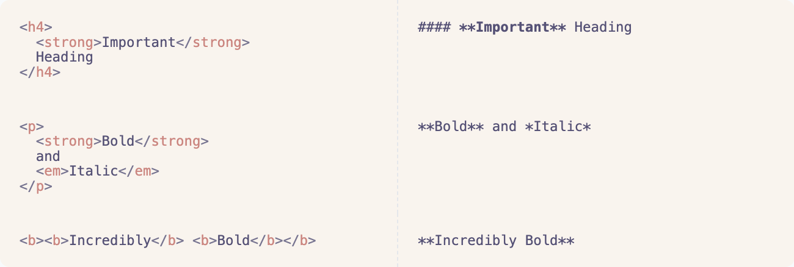
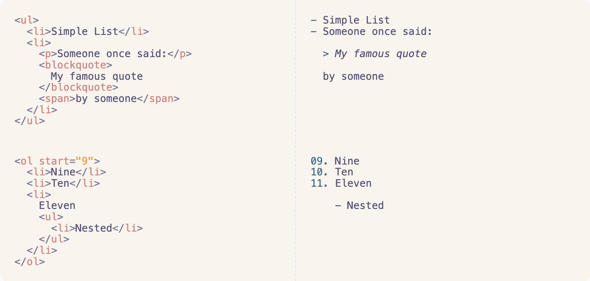
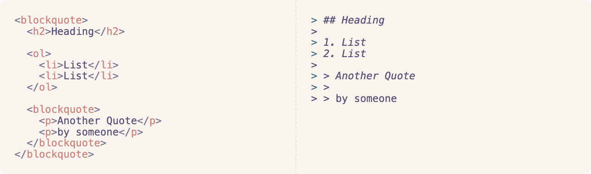
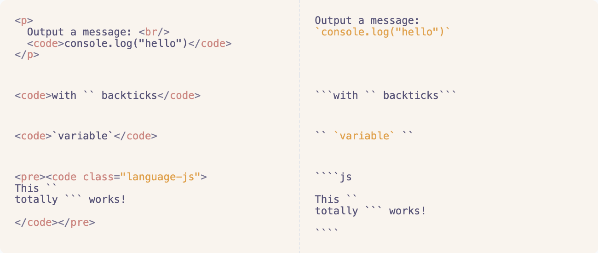
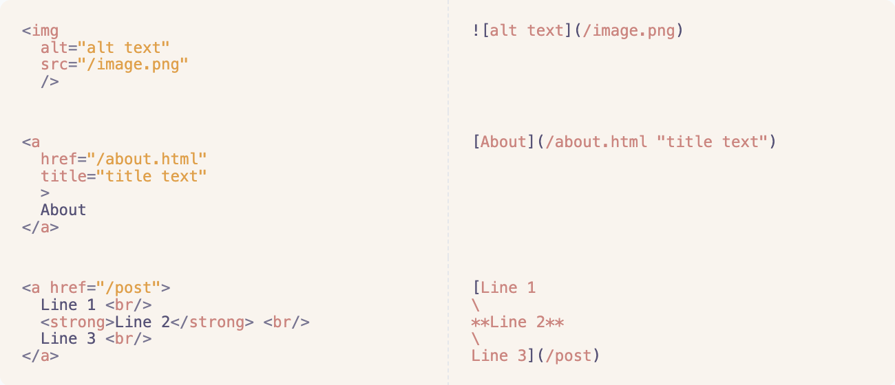
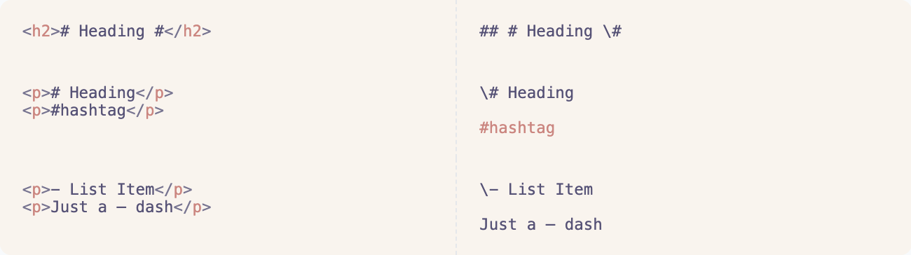
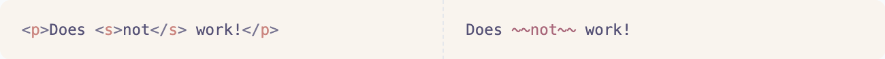
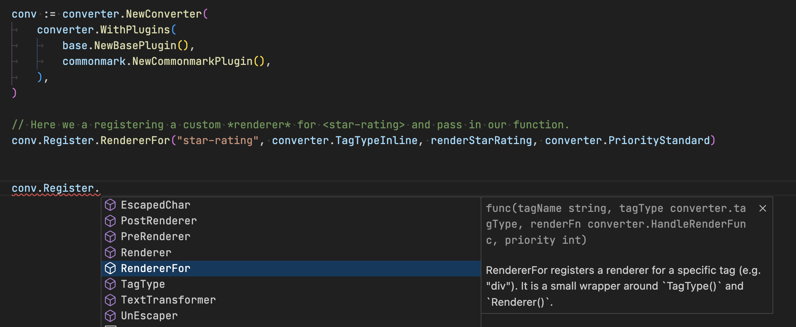

# html-to-markdown

A robust html-to-markdown converter that transforms HTML (even entire websites) into clean, readable Markdown. It supports complex formatting, customizable options, and plugins for full control over the conversion process.

Use the fully extendable [Golang library](#golang-library) or a quick [CLI command](#cli---using-it-on-the-command-line). Alternatively, try the [Online Demo](https://html-to-markdown.com/demo) or [REST API](https://html-to-markdown.com/api) to see it in action!

Here are some _cool features_:

- **Bold & Italic:** Supports bold and italic—even within single words.

  

- **List:** Handles ordered and unordered lists with full nesting support.

  

- **Blockquote:** Blockquotes can include other elements, with seamless support for nested quotes.

  

- **Inline Code & Code Block:** Correctly handles backticks and multi-line code blocks, preserving code structure.

  

- **Link & Image:** Properly formats multi-line links, adding escapes for blank lines where needed.

  

- **Smart Escaping:** Escapes special characters only when necessary, to avoid accidental Markdown rendering.
  🗒️ [ESCAPING.md](/ESCAPING.md)

  

- **Remove/Keep HTML:** Choose to strip or retain specific HTML tags for ultimate control over output.

  

- **Plugins:** Easily extend with plugins. Or create custom ones to enhance functionality.

  

---

---

## Golang Library

### Installation

```bash
go get -u github.com/JohannesKaufmann/html-to-markdown/v2
```

_Or if you want a specific commit add the suffix `/v2@commithash`_

> [!NOTE]  
> This is the documentation for the v2 library. For the old version switch to the ["v1" branch](https://github.com/JohannesKaufmann/html-to-markdown/tree/v1).

### Usage

[](https://pkg.go.dev/github.com/JohannesKaufmann/html-to-markdown/v2)

```go
package main

import (
	"fmt"
	"log"

	htmltomarkdown "github.com/JohannesKaufmann/html-to-markdown/v2"
)

func main() {
	input := `<strong>Bold Text</strong>`

	markdown, err := htmltomarkdown.ConvertString(input)
	if err != nil {
		log.Fatal(err)
	}
	fmt.Println(markdown)
	// Output: **Bold Text**
}
```

- 🧑‍💻 [Example code, basics](/examples/basics/main.go)

Use `WithDomain` to convert _relative_ links to _absolute_ links:

```go
package main

import (
	"fmt"
	"log"

	htmltomarkdown "github.com/JohannesKaufmann/html-to-markdown/v2"
	"github.com/JohannesKaufmann/html-to-markdown/v2/converter"
)

func main() {
	input := ``

	markdown, err := htmltomarkdown.ConvertString(
		input,
		converter.WithDomain("https://example.com"),
	)
	if err != nil {
		log.Fatal(err)
	}
	fmt.Println(markdown)
	// Output: 
}
```

The function `htmltomarkdown.ConvertString()` is a _small wrapper_ around `converter.NewConverter()` and the _base_ and _commonmark_ plugins. If you want more control, use the following:

```go
package main

import (
	"fmt"
	"log"

	"github.com/JohannesKaufmann/html-to-markdown/v2/converter"
	"github.com/JohannesKaufmann/html-to-markdown/v2/plugin/base"
	"github.com/JohannesKaufmann/html-to-markdown/v2/plugin/commonmark"
)

func main() {
	input := `<strong>Bold Text</strong>`

	conv := converter.NewConverter(
		converter.WithPlugins(
			base.NewBasePlugin(),
			commonmark.NewCommonmarkPlugin(
				commonmark.WithStrongDelimiter("__"),
				// ...additional configurations for the plugin
			),
		),
	)

	markdown, err := conv.ConvertString(input)
	if err != nil {
		log.Fatal(err)
	}
	fmt.Println(markdown)
	// Output: __Bold Text__
}
```

- 🧑‍💻 [Example code, options](/examples/options/main.go)

> [!NOTE]  
> If you use `NewConverter` directly make sure to also **register the commonmark and base plugin**.

### Plugins

#### Published Plugins

These are the plugins located in the [plugin folder](/plugin):

| Name                  | Description                                                                          |
| --------------------- | ------------------------------------------------------------------------------------ |
| Base                  | Implements basic shared functionality (e.g. removing nodes)                          |
| Commonmark            | Implements Markdown according to the [Commonmark Spec](https://spec.commonmark.org/) |
|                       |                                                                                      |
| GitHubFlavored        | _planned_                                                                            |
| TaskListItems         | _planned_                                                                            |
| Strikethrough         | Converts `<strike>`, `<s>`, and `<del>` to the `~~` syntax.                          |
| Table                 | _planned_                                                                            |
|                       |                                                                                      |
| VimeoEmbed            | _planned_                                                                            |
| YoutubeEmbed          | _planned_                                                                            |
|                       |                                                                                      |
| ConfluenceCodeBlock   | _planned_                                                                            |
| ConfluenceAttachments | _planned_                                                                            |

> [!NOTE]  
> Not all the plugins from v1 are already ported to v2. These will soon be implemented...

These are the plugins in other repositories:

| Name                         | Description         |
| ---------------------------- | ------------------- |
| \[Plugin Name\]\(Your Link\) | A short description |

#### Writing Plugins

You want to write custom logic?

1. Write your logic and **register** it.

   

   - 🧑‍💻 [Example code, register](/examples/register/main.go)

2. _Optional:_ Package your logic into a **plugin** and publish it.

   - 🗒️ [WRITING_PLUGINS.md](/WRITING_PLUGINS.md)

---

---

## CLI - Using it on the command line

Using the Golang library provides the most customization, while the CLI is the simplest way to get started.

### Installation

#### Homebrew Tap

```bash
brew install JohannesKaufmann/tap/html2markdown
```

#### Manually

Download the pre-compiled binaries from the [releases page](https://github.com/JohannesKaufmann/html-to-markdown/releases) and copy them to the desired location.

### Version

```bash
html2markdown --version
```

> [!NOTE]  
> Make sure that `--version` prints `2.X.X` as there is a different CLI for V2 of the converter.

### Usage

```bash
$ echo "<strong>important</strong>" | html2markdown

**important**
```

```text
$ curl --no-progress-meter http://example.com | html2markdown

# Example Domain

This domain is for use in illustrative examples in documents. You may use this domain in literature without prior coordination or asking for permission.

[More information...](https://www.iana.org/domains/example)
```

Use `--help` to learn about the configurations, for example:

- `--domain="https://example.com"` to convert _relative_ links to _absolute_ links.
- `--exclude-selector=".ad"` to exclude the html elements with `class="ad"` from the conversion.
- `--include-selector="article"` to only include the `<article>` html elements in the conversion.

_(The cli does not support every option yet. Over time more customization will be added)_

---

---

## FAQ

### Extending with Plugins

- Need your own logic? Write your own code and then **register** it.

  - Don't like the **defaults** that the library uses? You can use `PriorityEarly` to run you logic _earlier_ than others.

  - 🧑‍💻 [Example code, register](/examples/register/main.go)

- If you believe that you logic could also benefit others, you can package it up into a **plugin**.

  - 🗒️ [WRITING_PLUGINS.md](/WRITING_PLUGINS.md)

### Bugs

You found a bug?

[Open an issue](https://github.com/JohannesKaufmann/html-to-markdown/issues/new/choose) with the HTML snippet that does not produce the expected results. Please, please, plase _submit the HTML snippet_ that caused the problem. Otherwise it is very difficult to reproduce and fix...

### Security

This library produces markdown that is readable and can be changed by humans.

Once you convert this markdown back to HTML (e.g. using [goldmark](https://github.com/yuin/goldmark) or [blackfriday](https://github.com/russross/blackfriday)) you need to be careful of malicious content.

This library does NOT sanitize untrusted content. Use an HTML sanitizer such as [bluemonday](https://github.com/microcosm-cc/bluemonday) before displaying the HTML in the browser.

🗒️ [SECURITY.md](/SECURITY.md) if you find a security vulnerability

### Goroutines

You can use the `Converter` from (multiple) goroutines. Internally a mutex is used & there is a test to verify that behaviour.

### Escaping & Backslash

Some characters have a special meaning in markdown (e.g. "\*" for emphasis). The backslash `\` character is used to "escape" those characters. That is perfectly safe and won't be displayed in the final render.

🗒️ [ESCAPING.md](/ESCAPING.md)

### Contributing

You want to contribute? Thats great to hear! There are many ways to help:

Helping to answer questions, triaging issues, writing documentation, writing code, ...

If you want to make a code change: Please first discuss the change you wish to make, by opening an issue. I'm also happy to guide you to where a change is most likely needed. There are also extensive tests (see below) so you can freely experiment 🧑‍🔬

_Note: The outside API should not change because of backwards compatibility..._

### Testing

You don't have to be afraid of breaking the converter, since there are many "Golden File" tests:

Add your problematic HTML snippet to one of the `.in.html` files in the `testdata` folders. Then run `go test -update` and have a look at which `.out.md` files changed in GIT.

You can now change the internal logic and inspect what impact your change has by running `go test -update` again.

_Note: Before submitting your change as a PR, make sure that you run those tests and check the files into GIT..._

### License

Unless otherwise specified, the project is licensed under the terms of the MIT license.

🗒️ [LICENSE](/LICENSE)
